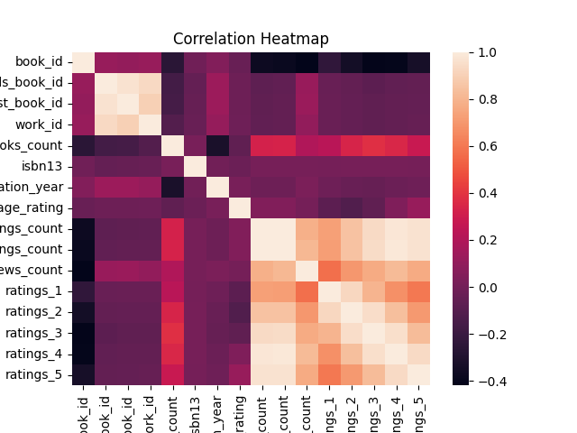
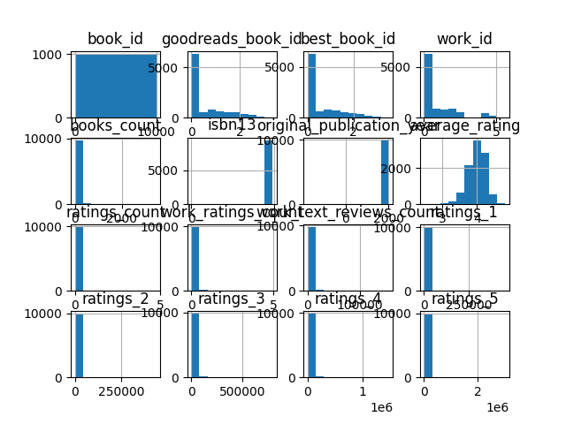

# 📊 Dataset Analysis Report

## 📁 Overview
- Rows: 10000
- Columns: 23

## 📌 Columns
['book_id', 'goodreads_book_id', 'best_book_id', 'work_id', 'books_count', 'isbn', 'isbn13', 'authors', 'original_publication_year', 'original_title', 'title', 'language_code', 'average_rating', 'ratings_count', 'work_ratings_count', 'work_text_reviews_count', 'ratings_1', 'ratings_2', 'ratings_3', 'ratings_4', 'ratings_5', 'image_url', 'small_image_url']

## ⚠️ Missing Values
{'book_id': 0, 'goodreads_book_id': 0, 'best_book_id': 0, 'work_id': 0, 'books_count': 0, 'isbn': 700, 'isbn13': 585, 'authors': 0, 'original_publication_year': 21, 'original_title': 585, 'title': 0, 'language_code': 1084, 'average_rating': 0, 'ratings_count': 0, 'work_ratings_count': 0, 'work_text_reviews_count': 0, 'ratings_1': 0, 'ratings_2': 0, 'ratings_3': 0, 'ratings_4': 0, 'ratings_5': 0, 'image_url': 0, 'small_image_url': 0}

## 📈 Analysis
- Data analyzed using pandas & numpy
- Summary statistics calculated
- Correlation analysis performed

## 🔍 Insights
- Trends identified from numeric data
- Relationships shown using heatmap
- Distribution visualized using histogram

## 💡 Recommendations
- Handle missing values appropriately
- Use correlations for predictive insights
- Perform deeper feature-level analysis

## 📊 Charts

