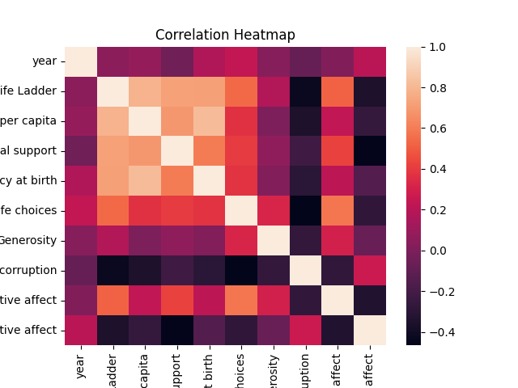
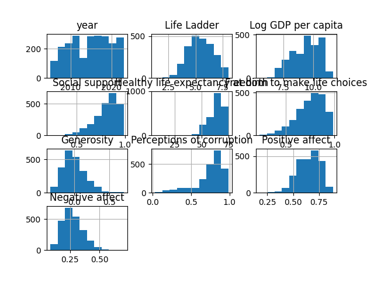

# 📊 Dataset Analysis Report

## 📁 Overview
- Rows: 2363
- Columns: 11

## 📌 Columns
['Country name', 'year', 'Life Ladder', 'Log GDP per capita', 'Social support', 'Healthy life expectancy at birth', 'Freedom to make life choices', 'Generosity', 'Perceptions of corruption', 'Positive affect', 'Negative affect']

## ⚠️ Missing Values
{'Country name': 0, 'year': 0, 'Life Ladder': 0, 'Log GDP per capita': 28, 'Social support': 13, 'Healthy life expectancy at birth': 63, 'Freedom to make life choices': 36, 'Generosity': 81, 'Perceptions of corruption': 125, 'Positive affect': 24, 'Negative affect': 16}

## 📈 Analysis
- Data analyzed using pandas & numpy
- Summary statistics calculated
- Correlation analysis performed

## 🔍 Insights
- Trends identified from numeric data
- Relationships shown using heatmap
- Distribution visualized using histogram

## 💡 Recommendations
- Handle missing values appropriately
- Use correlations for predictive insights
- Perform deeper feature-level analysis

## 📊 Charts

