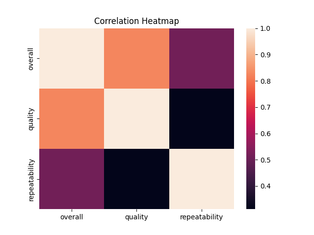
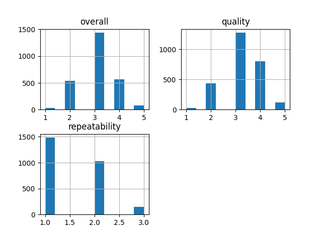

# 📊 Dataset Analysis Report

## 📁 Overview
- Rows: 2652
- Columns: 8

## 📌 Columns
['date', 'language', 'type', 'title', 'by', 'overall', 'quality', 'repeatability']

## ⚠️ Missing Values
{'date': 99, 'language': 0, 'type': 0, 'title': 0, 'by': 262, 'overall': 0, 'quality': 0, 'repeatability': 0}

## 📈 Analysis
- Data analyzed using pandas & numpy
- Summary statistics calculated
- Correlation analysis performed

## 🔍 Insights
- Trends identified from numeric data
- Relationships shown using heatmap
- Distribution visualized using histogram

## 💡 Recommendations
- Handle missing values appropriately
- Use correlations for predictive insights
- Perform deeper feature-level analysis

## 📊 Charts

